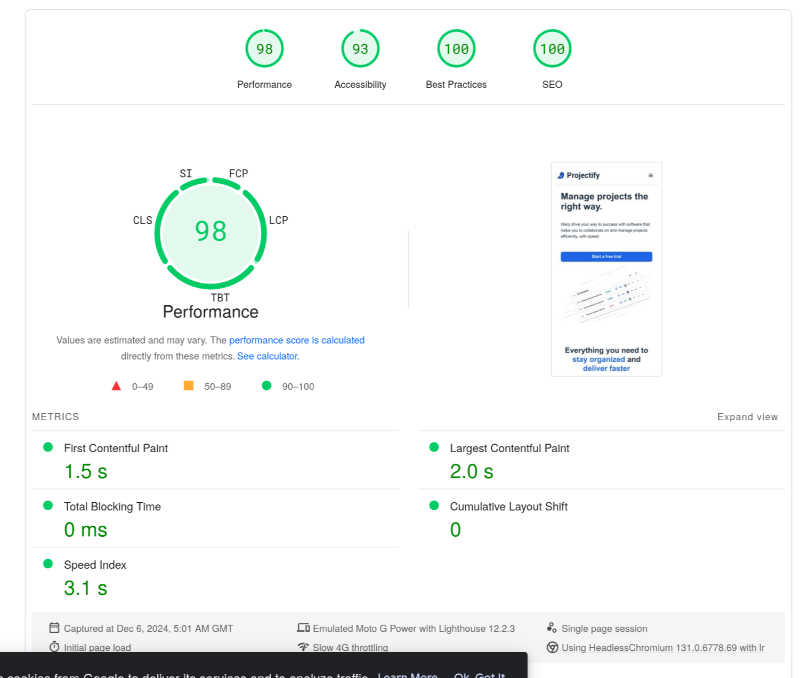
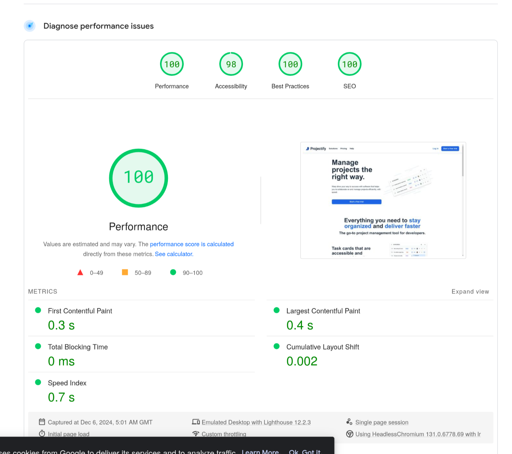

<!--
SPDX-FileCopyrightText: 2024 JWP Consulting GK

SPDX-License-Identifier: AGPL-3.0-or-later
-->

Here's is my work log for this project.

# 2024-11-25

I created a project detail view showing the sections and tasks in a project. It
was very easy to make using the Django `generic.detail.DetailView`. The
template naming is somewhat implicit, and the template is automatically picked
up from `workspace/project_detail.html` inside the
`projectify/workspace/templates` directory.

The URL is temporary for now:

```
workspace/project/<uuid>/view
```

It was pleasant to work with Django, there even is a debug toolbar which I have
added a long time ago for admin panel debugging.

# 2024-11-26

I would like to see if Tailwind works with Django. I'm following the
instructions here:

https://django-tailwind.readthedocs.io/en/latest/installation.html

Result: It is integrated into the backend flake build process (after a lot of
experimentation and various Nix path issues)

# 2024-11-27

I tested out `django-htmx`.

https://django-htmx.readthedocs.io/en/latest/installation.html

It was very easy to add.

There was an issue with tailwind not recognizing the templates. It was solved
by correcting the `contents` variable and give it the right glob to scan for
templates in Projectify. It was a bit confusing to correct since it uses a
relative path from within `projectify/theme/static_src`.

With `django-htmx` I now have sections where tasks can be moved up or down, and
only the contents of the section are replaced. Even better: It still works with
JavaScript turned off, in which case it moves tasks and then reloads the whole
page.

# 2024-11-29

Today I will try `django-components`:

https://github.com/EmilStenstrom/django-components

I find that a large part of frontend components props exist to configure
behavior, not style. It might be possible to re-implement components in the
backend and only add a few style props here and there. It might also be a good
opportunity to simplify the styling in general.

`django-components` seems very complex, and could almost be too much for our
purposes.

Let's consider for a second what the alternatives to migrating everything to
Django are:

## Keep SvelteKit and Django architecture

Doesn't change anything. Initial page loads are slow. Maintaining two different
applications is too much for a single developer.

## Migrate everything to be in SvelteKit

The Django ORM alone, and all the security stuff in it make Django worth it
even if just used for a backend. Using SvelteKit to take over the backend part
would not only mean having to re-implement well-tested business logic, it would
also mean compromising on security and quality.

## Migrate everything to a completely different framework/language/library

Why not re-implement everything and make it a slick single binary Go app? Sure,
but again, Django is incredibly powerful when it comes to database-centric
web-apps. Yes, I might also just use Rails or Laravel, but given that I haven't
used Rails in a long time, and don't know Laravel, these aren't good options
either. Go is a great programming language and the fact that it's so simple
would allow me to focus on the "important bits", like making an app that is
useful.

Re-implementing everything using something different means that the work
doubles, since both frontend and backend have to be rewritten. Rewriting the
frontend alone is already a lot of work, and more than that could be
devastating for motivation.

## Fix SSR in SvelteKit

> SvelteKit is a framework for rapidly developing robust, performant web
> applications using Svelte. If you’re coming from React, SvelteKit is similar
> to Next. If you’re coming from Vue, SvelteKit is similar to Nuxt.

I have tried to fix SSR by shifting around stores and so on to eliminate global
state. Yes, it's possible, but I feel like SvelteKit just hasn't been made to
guide you in the right direction and do those things properly from the
beginning. This makes me doubt that SvelteKit is a framework for making web
applications. A framework for making web applications should come with guard
rails that make accidentally embedding global state into your app difficult.

The **State management** [docs](https://svelte.dev/docs/kit/state-management)
were added quite late, and are not helpful after having made a full app. It
makes me question whether there won't be any other surprises.

There are other ideological points where I don't like SvelteKit's direction.
There is a subtle push to use VS Code to write SvelteKit, and despite the
complaints of many users, SvelteKit 1.0 uses square brackets and parentheses to
configure route paths.

The fact that the deploy documentation barely describes the self-hosted use
case also says a lot. I don't like being subtly pushed to using Vercel or
whatever other surprise-1000-USD charge service. Projectify is supposed to be a
self-hostable project management app. Creating all these proprietary lock-ins
doesn't help at all.

Backend/Frontend is an embarrassingly bad pattern for what is essentially a
skin for a database, a glorified excel spreadsheet with some authentication
sprinkled on top (I exaggerate, of course).

In the end all these ideological disagreements also strengthen my desire to
migrate away from SvelteKit. Making Projectify simple, even if that means
giving up a few features, is a net-positive for users and of course the solo
developer working on this project right now.

Django is quite mature, its documentation is translated into many languages,
and in general a good thing to use when trying to create something and opening
it up to the people.

If Projectify is supposed to be maintained for years to come, then going
through the painful process of a rewrite is a one-time thing, and everything
good after that will be a gift that keeps on giving.

# 2024-12-03

Today I will try `Alpine.js`.

https://alpinejs.dev/start-here

I copied the unified JavaScript file from
https://cdn.jsdelivr.net/npm/alpinejs@3.x.x/dist/cdn.min.js

Then, I've tried adding a label search that only renders when `Alpine.js` has
loaded using the docs at
https://alpinejs.dev/start-here#building-a-search-input

Using `:class`, I can make a search form that is only shown when Alpine loads.
See https://alpinejs.dev/directives/bind#class-object-syntax

Having interactive search is pretty nice, it might allow taking over the user
and label filter from the SPA.

## Identify remaining risks

Here are some of the remaining risks that I have identified over the last few
days of writing this document and experimenting with various libraries:

- Modal-less page flows might be very difficult to implement or decrease the
  usability a lot
- Adding too many backend and frontend libraries may cause the backend to bloat
  and return Projectify to the current bloated and slow state
- Any of the newly evaluated libraries might be abandoned or otherwise become
  unusuable for Projectify
- Porting components might be a gigantic time sinkhole

I will address each concern:

### Modal-less difficulties

Yep, a few pages have to be crafted for the constructive and destructive
modals. This will cause extra architecture, UX design, and coding work. This is
well worth it, since not only will it be pretty HTML with URLs as state, it
will most likely have better accessibility that Projectify's homebrew focus
trap that I've used before.

### Bloat

Yes, this is a real risk. Already, having added the tailwind and django
components library, Django has become a bit bloated.

I think it's not necessary to use a components library. I might just use
partials for everything. The settings are a bit non-intuitive and I've
encountered a strange error message that was difficult to debug:

```
  File "/.../django/__init__.py", line 24, in setup
    apps.populate(settings.INSTALLED_APPS)
  File "/.../django/apps/registry.py", line 124, in populate
    app_config.ready()
  File "/.../django_components/apps.py", line 24, in ready
    autodiscover()
  File "/.../django_components/autodiscovery.py", line 38, in autodiscover
    return _import_modules([entry.dot_path for entry in modules], map_module)
           ^^^^^^^^^^^^^^^^^^^^^^^^^^^^^^^^^^^^^^^^^^^^^^^^^^^^^^^^^^^^^^^^^^
  File "/.../django_components/autodiscovery.py", line 93, in _import_modules
    importlib.import_module(module_name)
  File "/.../importlib/__init__.py", line 126, in import_module
    return _bootstrap._gcd_import(name[level:], package, level)
           ^^^^^^^^^^^^^^^^^^^^^^^^^^^^^^^^^^^^^^^^^^^^^^^^^^^^
  File "<frozen importlib._bootstrap>", line 1204, in _gcd_import
  File "<frozen importlib._bootstrap>", line 1176, in _find_and_load
  File "<frozen importlib._bootstrap>", line 1140, in _find_and_load_unlocked
ModuleNotFoundError: No module named 'components'
```

The solution was to disable `autodiscover` for Django components.

The Django Tailwind integration on the other hand is well worth it. Adjusting
the Nix build was not very intuitive, but it works.

### Abandonware worries

Sometimes Django libraries get abandoned. This might happen with the Tailwind
integration used here, or the Django components. Tailwind itself will not
likely become abandonware, so it's not a big issue. I think I might even get
away just running Tailwind directly without any extras.

Alpine.js and HTMX might slow down in development at some point. The two
libraries are already extremely mature. I don't think abandonment is a big
issue to worry about with these widely used libraries. Both of them seem to
have stable funding as well.

### Time sinkhole

No one said it would be quick, but we're not in it to make a quick buck. I'd
like to create a rock-solid icebreaker, not a Rube Goldberg Machine that
constantly breaks because of 3rd order transient NPM dependencies. Also, this
thing is supposed to be a To Do list?

# 2024-12-06

Now I am determining the acceptance criteria.

## Functional requirements

Naturally, a regression in functionality shall be avoided at any cost, but not
realistic. Bugs will always sneak in, and the UI will change and the migration
will introduce new usability issues. Still, to set a minimum standard, we want
to ensure few things. I've added these to `docs/remove-fe.md`.

## Non-functional requirements

A performance degradation should be avoided.

The landing page was tested with PageSpeed Insights:

https://pagespeed.web.dev/analysis/https-www-projectifyapp-com/bhyke2wc99?form_factor=mobile

The following values were measures:

| Measurement    | Mobile | Browser |
| -------------- | ------ | ------- |
| Performance    | 98     | 100     |
| Accessibility  | 93     | 98      |
| Best Practices | 100    | 100     |
| SEO            | 100    | 100     |




These, of course, are measurements for the landing page.

Comparing this to Firefox running on my NixOS workstation, I see, for `/` the
following values in the network tab in a cache-less load:

- 84 requests
- 1.04 MB / 427.63 kB transferred
- Finish: 961 ms
- `DOMContentLoaded`: 390 ms
- `load`: 690 ms

With throttling set to "Good 3G", I see:

- 84 requests
- 1.08 MB / 405.88 kB transferred
- Finish: 2.52 ms
- `DOMContentLoaded`: 572 ms
- `load`: 1.57 s

These measurements should be interpreted with caution. PageSpeed Insights
emulates a "Moto G Power" with "Slow 4G throttling".

Furthermore, using Firefox's network tab, I measure a load from `/dashboard`,
which will always be slow since there is a long redirect chain to the actual
project happening.

- 87 requests
- 712.68kb / 319.08 kb transferred
- Finish: 2.79s
- `DOMContentLoaded`: 170 ms
- `load`: 170 ms

With throttling set to "Good 3G", I see:

- 86 requests
- 721.47 kB / 249.85 kB transferred
- Finish: 3.28 s
- `DOMContentLoaded`: 222 ms
- `load`: 222 ms

Based on the above values, some speed requirements were defined in
`docs/remove-fe.md`.

# 2024-12-09

I noticed that I haven't investigated adding widget templates for Django
forms. I also have to figure out how easy it is to reimplement the
more complex serializers as Django forms.

The widgets can be overwritten by creating templates in
`django/forms/templates`. Reference:

- https://docs.djangoproject.com/en/5.1/ref/forms/renderers/#djangotemplates
- https://github.com/django/django/tree/main/django/forms/templates/django/forms

The most complex serializer that Projectify has is the
`TaskCreateUpdateSerializer` in
`projectify/workspace/serializers/task_detail.py`. That thing is really, really
complex.
